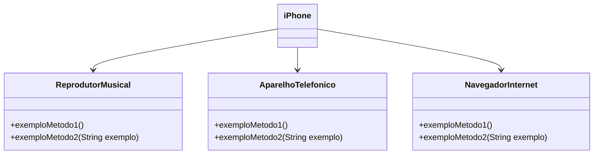

<h1 align="center">
 Desafio Iphone DIO
</h1>

<p align="center">
	<b><i>
Modelagem e diagramação da representação em UML e Código no que se refere ao componente iPhone. 
  </i></b>
</p>

<p align="center">
	
	
</p>

## 💡 Sobre o projeto
Com base no vídeo de lançamento do iPhone, elabore em uma ferramenta de UML de sua preferência a diagramação das classes e interfaces com a proposta de representar os papéis do iPhone de: Reprodutor Musicial,  Aparelho Telefônico e Navegador na Internet. Em seguida crie as classes e interfaces no formato de arquivos .java
 <br> <br>

## 📁 Estrutura/
- [src] código do fonte 
- Diagrama de Classes listado abaixo.
- ```README.md```  Informações do projeto.  
## 📍 Instruções 

### Exemplo de Diagrama UML (Mermaid)



### Pré-Requisitos

###### Comportamentos esperados:
* Repodutor Musicial: tocar, pausar, selecionarMusica
* Aparelho Telefônico: ligar, atender, iniciarCorrerioVoz
* Navegador na Internet: exibirPagina, adicionarNovaAba, atualizarPagina

##  🔧 Tecnologias

  
## 🔗 Referências
- Videoaulas do Bootcamp Desenvolvimento Java com IA na plataforma da DIO


## ✅ Feedback

Caso tenha algum feedback, entre em contato!

<a href = "mailto:daniellopesfilho2017@gmail.com"></a> 
<a href="https:/[/https://www.linkedin.com/in/daniel-lopes-filho/]/" target="_blank"></a>

<p align="center"> Desenvolvido por Daniel Lopes Filho </p>
